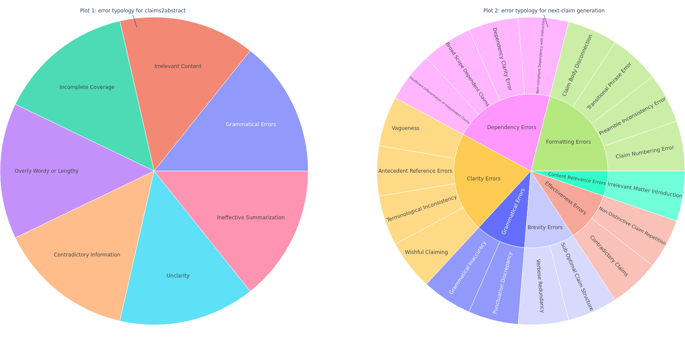

# PatentEval: Understanding Errors in Patent Generation

This code accompanies the NAACL 2024 article of the above name. With the long-term goal of applying AI techniques to patent drafting,

- we introduce a comprehensive error typology specifically designed for evaluating two distinct tasks in machine-generated patent texts: claims-to-abstract generation, and the generation of the next claim given previous ones.
- We have also developed a benchmark, PatentEval, for systematically assessing language models in this context. Our study includes a comparative analysis, annotated by humans, of various models. These range from those specifically adapted during training for tasks within the patent domain to the latest general-purpose LLMs.
- Furthermore, we explored and evaluated some metrics to approximate human judgments in patent text evaluation, analyzing the extent to which these metrics align with expert assessments.

## Error Typology
We show the error topology for two different tasks in the figure below, and more definitions of each error category can be verified from the guidelines under [`human_eval`](https://github.com/ZoeYou/PatentEval/tree/main/human_eval) or from our pape.

<p  align="center"></p>

## Datasets
The data sample used for our annotations for two tasks can be found:
- claims2abstract: [`human_eval/preprocessed_for_annotation/human_eval_c2a.json`](https://github.com/ZoeYou/PatentEval/tree/main/human_eval/preprocessed_for_annotation/human_eval_c2a.json)
- next-claim generation: [`human_eval/preprocessed_for_annotation/human_eval_c2c.json`](https://github.com/ZoeYou/PatentEval/tree/main/human_eval/preprocessed_for_annotation/human_eval_c2c.json)


## Citation

If you use this work, please cite the following article:

Zuo, You, Kim Gerdes, Eric Villemonte de La Clergerie, and Benoît Sagot. [**PatentEval: Understanding Errors in Patent Generation.**](https://arxiv.org/pdf/2406.06589) In NAACL2024-2024 Annual Conference of the North American Chapter of the Association for Computational Linguistics. 2024.

```
@inproceedings{zuo2024patenteval,
  title={PatentEval: Understanding Errors in Patent Generation},
  author={Zuo, You and Gerdes, Kim and de La Clergerie, Eric Villemonte and Sagot, Beno{\^\i}t},
  booktitle={NAACL2024-2024 Annual Conference of the North American Chapter of the Association for Computational Linguistics},
  year={2024}
}
```


